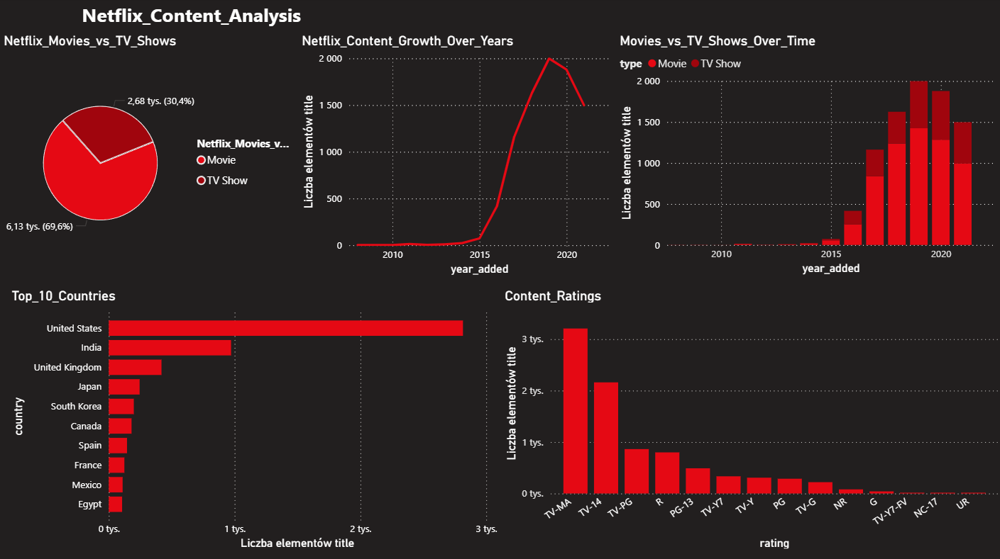

# Netflix Content Analysis 

Exploratory data analysis of Netflix titles dataset from Kaggle.
The project covers data cleaning, EDA in Python and an interactive dashboard in Power BI.

## Dataset
- Source: [Kaggle - Netflix Movies and TV Shows](https://www.kaggle.com/datasets/shivamb/netflix-shows)
- 8,807 titles (movies and TV shows)
- 12 columns: title, type, country, date_added, release_year, rating, duration, etc.

## Tools used
- Python 3 (pandas, matplotlib, seaborn)
- Jupyter Notebook
- Power BI Desktop

## Project structure

netflix_projekt/
netflix_titles.csv           # raw dataset from Kaggle
netflix_titles_analise.ipynb # data cleaning and EDA
netflix_cleaned.xlsx         # cleaned dataset exported for Power BI
netflix_dashboard.pbix       # Power BI dashboard

## What I did

**1. Data cleaning**
- Filled missing values in director, cast, country and rating columns with 'Unknown'
- Converted date_added column from string to datetime format
- Extracted year_added and month_added as separate columns
- Dropped 3 rows with missing duration values

**2. Exploratory Data Analysis**
- Movies vs TV Shows distribution (69.6% movies)
- Top 10 countries by number of titles
- Netflix content growth over years (peak in 2019)
- Most common content ratings (TV-MA dominates)

**3. Power BI Dashboard**
- 5 interactive visualizations on one page
- Filters applied to exclude unknown values
- Dark theme matching Netflix branding

## Key findings
- Netflix library is 70% movies and 30% TV shows
- United States dominates with 2,815 titles, followed by India (972 titles)
- Massive content growth between 2016-2019, slight decline after 2020 (likely COVID impact on productions)
- TV-MA rating is most common — Netflix targets adult audience

## Dashboard preview
